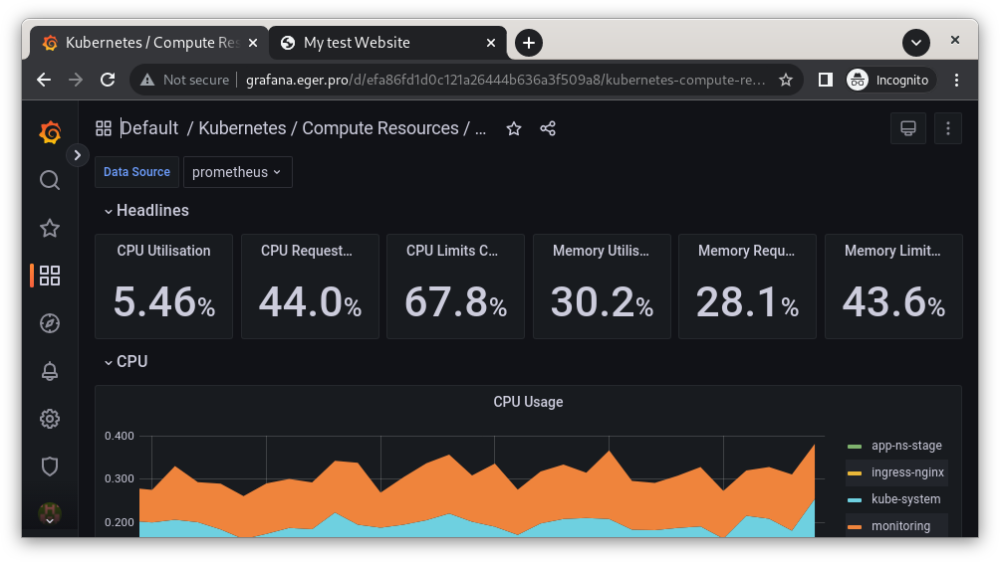
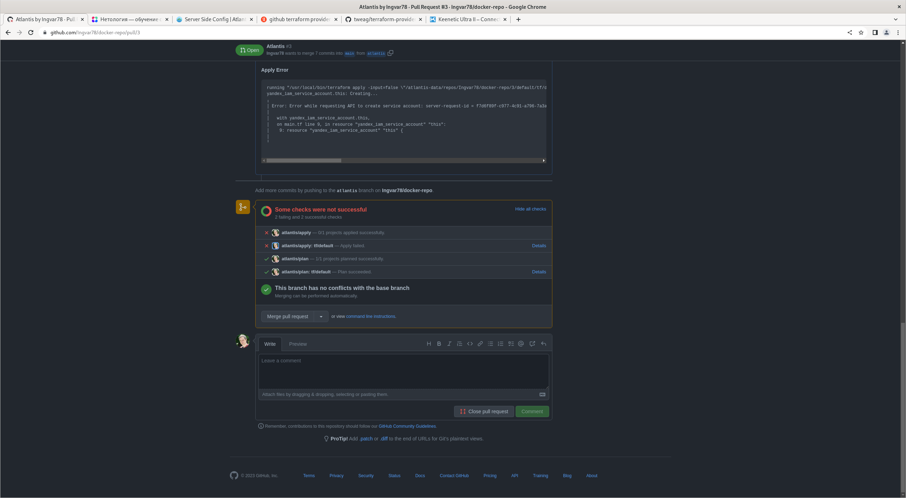

# Дипломный практикум в Yandex.Cloud
  * [Цели:](#цели)
  * [Этапы выполнения:](#этапы-выполнения)
     * [Создание облачной инфраструктуры](#создание-облачной-инфраструктуры)
     * [Создание Kubernetes кластера](#создание-kubernetes-кластера)
     * [Создание тестового приложения](#создание-тестового-приложения)
     * [Подготовка cистемы мониторинга и деплой приложения](#подготовка-cистемы-мониторинга-и-деплой-приложения)
     * [Установка и настройка CI/CD](#установка-и-настройка-cicd)
  * [Что необходимо для сдачи задания?](#что-необходимо-для-сдачи-задания)
  * [Как правильно задавать вопросы дипломному руководителю?](#как-правильно-задавать-вопросы-дипломному-руководителю)

---
## Цели:

1. Подготовить облачную инфраструктуру на базе облачного провайдера Яндекс.Облако.
2. Запустить и сконфигурировать Kubernetes кластер.
3. Установить и настроить систему мониторинга.
4. Настроить и автоматизировать сборку тестового приложения с использованием Docker-контейнеров.
5. Настроить CI для автоматической сборки и тестирования.
6. Настроить CD для автоматического развёртывания приложения.

---
## Этапы выполнения:


### 1. Создание облачной инфраструктуры

Для начала необходимо подготовить облачную инфраструктуру в ЯО при помощи [Terraform](https://www.terraform.io/).

Особенности выполнения:

Предварительная подготовка к установке и запуску Kubernetes кластера.

1. Создайте сервисный аккаунт, который будет в дальнейшем использоваться Terraform для работы с инфраструктурой с необходимыми и достаточными правами. Не стоит использовать права суперпользователя

Ниже приведены различные варианты созлания сервисного акканута, для решения поставленной задачи использовался [Вариант 2](./addition/1.0/) как наиболее оптимальный в данном случае.

- [Вариант 1](./addition/1/)
- [Вариант 2](./addition/1.0/)
- [Вариант 3](./addition/sa) - долгий... ручное создание 

2. Подготовьте [backend](https://www.terraform.io/docs/language/settings/backends/index.html) для Terraform:  
   а. Рекомендуемый вариант: [Terraform Cloud](https://app.terraform.io/)  
   б. Альтернативный вариант: S3 bucket в созданном ЯО аккаунте

- ввиду имеющихся ограничений при работе в дипломе будет использоваться S3 bucket в ЯО аккаунте. Создание аккаунта и S3 bucket-а производится с использованием [Вариант 2](./addition/1.0/), дальнейшая работа с terraform будет вестись с использованием созданного сервисного аккаунта.

* [Порядок создания сервисного аккаунта, файла с данными 'Service Account key file'](./addition/1.0/ReadMe_01.md)


3. Настройте [workspaces](https://www.terraform.io/docs/language/state/workspaces.html)  
   а. Рекомендуемый вариант: создайте два workspace: *stage* и *prod*. В случае выбора этого варианта все последующие шаги должны учитывать факт существования нескольких workspace.  
   б. Альтернативный вариант: используйте один workspace, назвав его *stage*. Пожалуйста, не используйте workspace, создаваемый Terraform-ом по-умолчанию (*default*).
4. Создайте VPC с подсетями в разных зонах доступности.
5. Убедитесь, что теперь вы можете выполнить команды `terraform destroy` и `terraform apply` без дополнительных ручных действий.
6. В случае использования [Terraform Cloud](https://app.terraform.io/) в качестве [backend](https://www.terraform.io/docs/language/settings/backends/index.html) убедитесь, что применение изменений успешно проходит, используя web-интерфейс Terraform cloud.

Ожидаемые результаты:

1. Terraform сконфигурирован и создание инфраструктуры посредством Terraform возможно без дополнительных ручных действий.
2. Полученная конфигурация инфраструктуры является предварительной, поэтому в ходе дальнейшего выполнения задания возможны изменения.

Достигнут ожидаемый результат, Terraform сконфигурирован для работы с S3 bucket в ЯО, используется workspace "stage", состояние terraform хранится в /neto-bucket-fdevops-13/env:/stage/terraform.tfstate.

[Полученная конфигурация инфраструктуры](./addition/1.1/) является предварительной и будет изменена в дальнейшем.


```
iva@c9v:~/Documents/Diplom/1.1 $ terraform workspace list 
  default
  prod
* stage
```

```
iva@c9v:~/Documents/devops-diplom-yandexcloud/addition/1.1  (1.2 *)$ tree 
.
├── generate_inventory.sh - генерация inventory для последующего использования в kubespray
├── k8s_deployer.tf	- инстанс для настройки kubernetes
├── k8s_instance.tf	- инстансы kubernetes
├── local.tf		- описание инстансов kubernetes через локальные переменные
├── main.tf		- основной модуль
├── network.tf		- описание создаваемых сетей через локальные переменнные
├── outputs.tf		- вывод результата создания инфраструктуры 
├── ReadMe_01.1.md
├── ReadMe_01.2.md
├── terraform.tfvars	- переменные terraform
├── variables.tf	- описание переменных terraform со значениями по умолчанию
└── versions.tf		- описание провайдера ЯО для terraform и хранения состояния в S3 bucket

0 directories, 12 files

```

---
### 2. Создание Kubernetes кластера

На этом этапе необходимо создать [Kubernetes](https://kubernetes.io/ru/docs/concepts/overview/what-is-kubernetes/) кластер на базе предварительно созданной инфраструктуры.   Требуется обеспечить доступ к ресурсам из Интернета.

Это можно сделать двумя способами:

1. Рекомендуемый вариант: самостоятельная установка Kubernetes кластера.  
   а. При помощи Terraform подготовить как минимум 3 виртуальных машины Compute Cloud для создания Kubernetes-кластера. Тип виртуальной машины следует выбрать самостоятельно с учётом требовании к производительности и стоимости. Если в дальнейшем поймете, что необходимо сменить тип инстанса, используйте Terraform для внесения изменений.  
   б. Подготовить [ansible](https://www.ansible.com/) конфигурации, можно воспользоваться, например [Kubespray](https://kubernetes.io/docs/setup/production-environment/tools/kubespray/)  
   в. Задеплоить Kubernetes на подготовленные ранее инстансы, в случае нехватки каких-либо ресурсов вы всегда можете создать их при помощи Terraform.
2. Альтернативный вариант: воспользуйтесь сервисом [Yandex Managed Service for Kubernetes](https://cloud.yandex.ru/services/managed-kubernetes)  
  а. С помощью terraform resource для [kubernetes](https://registry.terraform.io/providers/yandex-cloud/yandex/latest/docs/resources/kubernetes_cluster) создать региональный мастер kubernetes с размещением нод в разных 3 подсетях      
  б. С помощью terraform resource для [kubernetes node group](https://registry.terraform.io/providers/yandex-cloud/yandex/latest/docs/resources/kubernetes_node_group)
  
Ожидаемый результат:

1. Работоспособный Kubernetes кластер.
2. В файле `~/.kube/config` находятся данные для доступа к кластеру.
3. Команда `kubectl get pods --all-namespaces` отрабатывает без ошибок.

* Описание порядка развёртывания [Kubernetes](addition/2.0/ReadMe_kube.md)

```
iva@c9v:~/Documents/devops-diplom-yandexcloud  (2.0 *)$ kubectl get pods --all-namespaces
NAMESPACE     NAME                                       READY   STATUS    RESTARTS   AGE
kube-system   calico-kube-controllers-75748cc9fd-gfgkb   1/1     Running   0          77m
kube-system   calico-node-bnxb2                          1/1     Running   0          78m
kube-system   calico-node-cw7fp                          1/1     Running   1          78m
kube-system   calico-node-nsgcj                          1/1     Running   0          78m
kube-system   calico-node-qzdf8                          1/1     Running   0          78m
kube-system   coredns-588bb58b94-c4qmw                   1/1     Running   0          77m
kube-system   coredns-588bb58b94-kxzpt                   1/1     Running   0          77m
kube-system   dns-autoscaler-5b9959d7fc-94ljn            1/1     Running   0          77m
kube-system   kube-apiserver-cp1                         1/1     Running   1          79m
kube-system   kube-controller-manager-cp1                1/1     Running   1          79m
kube-system   kube-proxy-2ht95                           1/1     Running   0          78m
kube-system   kube-proxy-j2hq2                           1/1     Running   0          78m
kube-system   kube-proxy-pn7fh                           1/1     Running   0          78m
kube-system   kube-proxy-vm2d6                           1/1     Running   0          78m
kube-system   kube-scheduler-cp1                         1/1     Running   1          79m
kube-system   nginx-proxy-node1                          1/1     Running   0          77m
kube-system   nginx-proxy-node2                          1/1     Running   0          77m
kube-system   nginx-proxy-node3                          1/1     Running   0          77m
kube-system   nodelocaldns-7c4ns                         1/1     Running   0          77m
kube-system   nodelocaldns-7ln6t                         1/1     Running   0          77m
kube-system   nodelocaldns-8n7k6                         1/1     Running   0          77m
kube-system   nodelocaldns-bnhmf                         1/1     Running   0          77m

```

---
### 3. Создание тестового приложения

Для перехода к следующему этапу необходимо подготовить тестовое приложение, эмулирующее основное приложение разрабатываемое вашей компанией.

Способ подготовки:

1. Рекомендуемый вариант:
   а. Создайте отдельный git репозиторий с простым nginx конфигом, который будет отдавать статические данные.
   б. Подготовьте Dockerfile для создания образа приложения.
2. Альтернативный вариант:
   а. Используйте любой другой код, главное, чтобы был самостоятельно создан Dockerfile.

Ожидаемый результат:

1. [Git репозиторий с тестовым приложением и Dockerfile](https://github.com/Ingvar78/docker-repo/tree/main/fordocker).
2. Регистр с собранным docker image. В качестве регистра может быть DockerHub или [Yandex Container Registry](https://cloud.yandex.ru/services/container-registry), созданный также с помощью terraform.

* Тестовое приложение размещённое на [DockerHUB](https://hub.docker.com/repository/docker/egerpro/nginx-app/general)


---
### 4. Подготовка cистемы мониторинга и деплой приложения

Уже должны быть готовы конфигурации для автоматического создания облачной инфраструктуры и поднятия Kubernetes кластера.  
Теперь необходимо подготовить конфигурационные файлы для настройки нашего Kubernetes кластера.

Цель:
1. Задеплоить в кластер [prometheus](https://prometheus.io/), [grafana](https://grafana.com/), [alertmanager](https://github.com/prometheus/alertmanager), [экспортер](https://github.com/prometheus/node_exporter) основных метрик Kubernetes.
2. Задеплоить тестовое приложение, например, [nginx](https://www.nginx.com/) сервер отдающий статическую страницу.

Рекомендуемый способ выполнения:
1. Воспользовать пакетом [kube-prometheus](https://github.com/prometheus-operator/kube-prometheus), который уже включает в себя [Kubernetes оператор](https://operatorhub.io/) для [grafana](https://grafana.com/), [prometheus](https://prometheus.io/), [alertmanager](https://github.com/prometheus/alertmanager) и [node_exporter](https://github.com/prometheus/node_exporter). При желании можете собрать все эти приложения отдельно.
2. Для организации конфигурации использовать [qbec](https://qbec.io/), основанный на [jsonnet](https://jsonnet.org/). Обратите внимание на имеющиеся функции для интеграции helm конфигов и [helm charts](https://helm.sh/)
3. Если на первом этапе вы не воспользовались [Terraform Cloud](https://app.terraform.io/), то задеплойте в кластер [atlantis](https://www.runatlantis.io/) для отслеживания изменений инфраструктуры.

Альтернативный вариант:
1. Для организации конфигурации можно использовать [helm charts](https://helm.sh/)

Ожидаемый результат:
1. Git репозиторий с конфигурационными файлами для настройки [Kubernetes](./addition/2.0/).

2. Http доступ к web интерфейсу grafana. 


3. Дашборды в grafana отображающие состояние Kubernetes кластера.



4. Http доступ к тестовому приложению.


5. [Helm Atlantis](./addition/5.0/Atlantis/)




---
### 5. Установка и настройка CI/CD

Осталось настроить ci/cd систему для автоматической сборки docker image и деплоя приложения при изменении кода.

Цель:

1. Автоматическая сборка docker образа при коммите в репозиторий с тестовым приложением.
2. Автоматический деплой нового docker образа.


Можно использовать [teamcity](https://www.jetbrains.com/ru-ru/teamcity/), [jenkins](https://www.jenkins.io/) либо [gitlab ci](https://about.gitlab.com/stages-devops-lifecycle/continuous-integration/)

Ожидаемый результат:

1. Интерфейс ci/cd сервиса доступен по http. 
2. При любом коммите в репозиторие с тестовым приложением происходит сборка и отправка в регистр Docker образа.
3. При создании тега (например, v1.0.0) происходит сборка и отправка с соответствующим label в регистр, а также деплой соответствующего Docker образа в кластер Kubernetes.

---
## Что необходимо для сдачи задания?

1. [x] Репозиторий с конфигурационными файлами Terraform и готовность продемонстрировать создание всех ресурсов с нуля.
2. [x] Пример [pull request](https://github.com/Ingvar78/docker-repo/pull/3) с комментариями созданными atlantis'ом или снимки экрана из Terraform Cloud.
3. [x] Репозиторий с конфигурацией ansible, если был выбран способ создания Kubernetes кластера при помощи ansible.
4. [x] Репозиторий с Dockerfile тестового приложения и ссылка на собранный docker image.
5. [x] Репозиторий с конфигурацией Kubernetes кластера.
6. [x] Ссылка на тестовое приложение и веб интерфейс Grafana с данными доступа.

* для доступа к интерфейсу Grafana и тестовому приложению необходимо прописать в hosts следующие данные, т.к. публикаций A-записей в DNS не производилось:

```hosts
51.250.76.229 grafana grafana.eger.pro
51.250.76.229 testapp testapp.eger.pro
```
Доступ к Grafana: http://grafana.eger.pro/ admin/NetoAdmin (логин/пароль)

Тестовое приложение: http://testapp.eger.pro/

Доступ к Jenkins: http://84.201.173.5:8080/job/docker-repo/job/main/

* для корректной работы по http-протоколу рекомендуется использовать режим Incognito Chrome, т.к. в нём не происходит принудительное переключение на https.


7. [x] Все репозитории рекомендуется хранить на одном ресурсе (github, gitlab) - репозитории размещены на GitHub:

[https://github.com/Ingvar78/devops-diplom-yandexcloud](https://github.com/Ingvar78/devops-diplom-yandexcloud) - основоной репозиторий с данными terraform/ansible

[https://github.com/Ingvar78/docker-repo](https://github.com/Ingvar78/docker-repo) - репозиторий с тестовым приложением.

---
## Как правильно задавать вопросы дипломному руководителю?

Что поможет решить большинство частых проблем:

1. Попробовать найти ответ сначала самостоятельно в интернете или в 
  материалах курса и ДЗ и только после этого спрашивать у дипломного 
  руководителя. Скилл поиска ответов пригодится вам в профессиональной 
  деятельности.
2. Если вопросов больше одного, то присылайте их в виде нумерованного 
  списка. Так дипломному руководителю будет проще отвечать на каждый из 
  них.
3. При необходимости прикрепите к вопросу скриншоты и стрелочкой 
  покажите, где не получается.

Что может стать источником проблем:

1. Вопросы вида «Ничего не работает. Не запускается. Всё сломалось». 
  Дипломный руководитель не сможет ответить на такой вопрос без 
  дополнительных уточнений. Цените своё время и время других.
2. Откладывание выполнения курсового проекта на последний момент.
3. Ожидание моментального ответа на свой вопрос. Дипломные руководители работающие разработчики, которые занимаются, кроме преподавания, 
  своими проектами. Их время ограничено, поэтому постарайтесь задавать правильные вопросы, чтобы получать быстрые ответы :)
